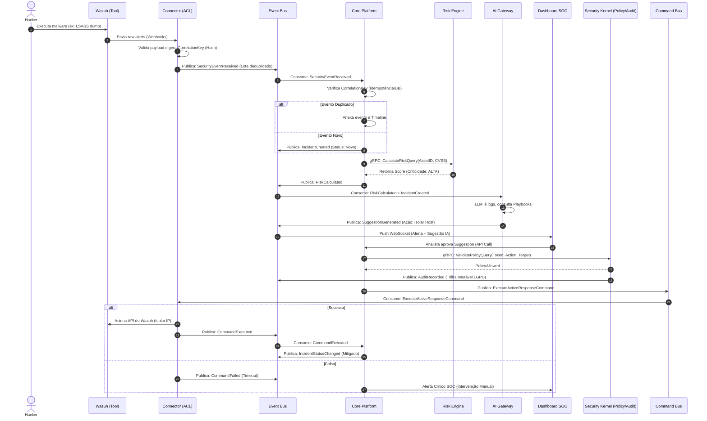

# M0.3 — Event Storming, Regras de Comunicação e Core Flows

## 1. Regra Arquitetural de Comunicação (Sync vs Async)

Para evitar que o sistema se torne uma teia de chamadas bloqueantes:

- **Assíncrono (Event/Command Bus via Redpanda/Kafka):** Para reações, efeitos colaterais, processamento pesado e notificações (ex: `IncidentCreated`, `ExecuteActiveResponseCommand`).
- **Síncrono (gRPC):** EXCLUSIVO para decisões que bloqueiam o fluxo de execução e exigem resposta imediata (ex: `ValidatePolicyQuery` no Security Kernel, `CalculateRiskQuery` no Risk Engine).

---

## 2. Fluxo Principal: Detecção, Triagem, Resposta e Auditoria

---

## 3. Regra de Ouro da IA

A IA **nunca** altera o estado do banco. O fluxo obrigatório é:
`IA -> Gera Suggestion -> Converte em Command -> Core -> Validação (Policy Engine) -> Execução -> Gera Event -> Persistence.`
