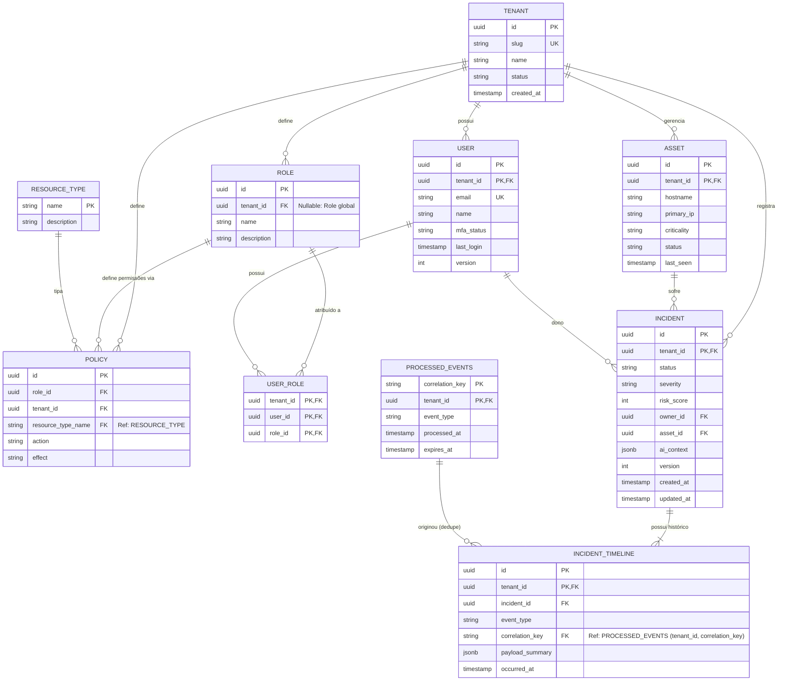

# M0.4 — Modelo ER do Banco Operacional (PostgreSQL v5.4)

## Diagrama Entidade-Relacionamento (Mermaid)

---

## 🔒 Garantia Cross-Tenant (Compound Foreign Keys)

Para impedir *Cross-Tenant Corruption* (ex: incidente do Tenant A apontar para um asset do Tenant B), todas as relações utilizam Foreign Keys compostas contendo `tenant_id`:

- `FOREIGN KEY (tenant_id, asset_id) REFERENCES ASSET(tenant_id, id)`
- `FOREIGN KEY (tenant_id, owner_id) REFERENCES USER(tenant_id, id)`
- `FOREIGN KEY (tenant_id, incident_id) REFERENCES INCIDENT(tenant_id, id)`
- `FOREIGN KEY (tenant_id, correlation_key) REFERENCES PROCESSED_EVENTS(tenant_id, correlation_key)`
