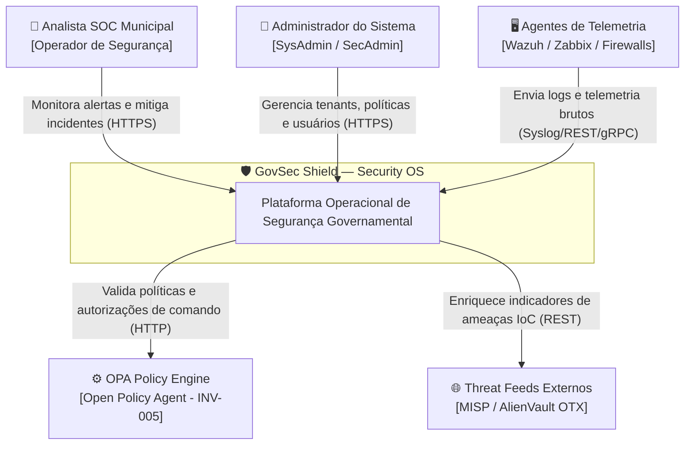
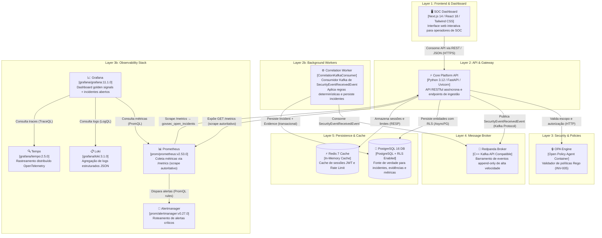
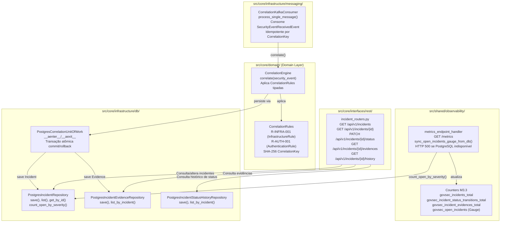

# Diagramas de Arquitetura C4 — GovSec Shield

Este documento especifica a arquitetura do **GovSec Shield** através do modelo C4 (Contexto, Contêineres e Componentes) utilizando sintaxe **Mermaid**.

---

## 1. Nível C1 — Diagrama de Contexto (System Context)

O Diagrama de Contexto ilustra o GovSec Shield no centro do ecossistema de segurança governamental, detalhando as interações com analistas de SOC, administradores municipais e sistemas externos integrados.

---

## 2. Nível C2 — Diagrama de Contêineres (Containers Diagram)

O Diagrama de Contêineres descreve a topologia interna das aplicações, barramentos de mensageria e bancos de dados que compõem o GovSec Shield, atualizado com os containers reais em execução (M3.3).

---

## 4. Nível C3 — Componentes M3.3: Incident API & Correlation Engine

Detalha o subsistema de Incidentes e Correlação implementado na Sprint M3.3.

