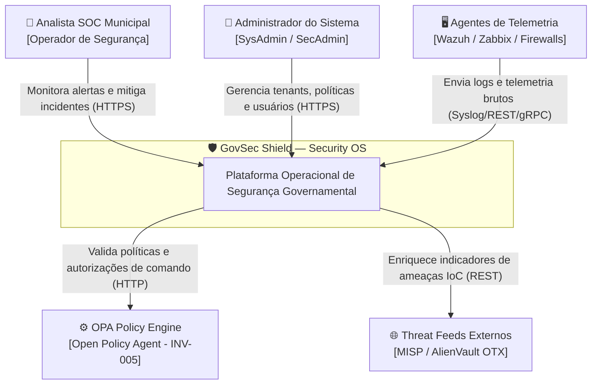
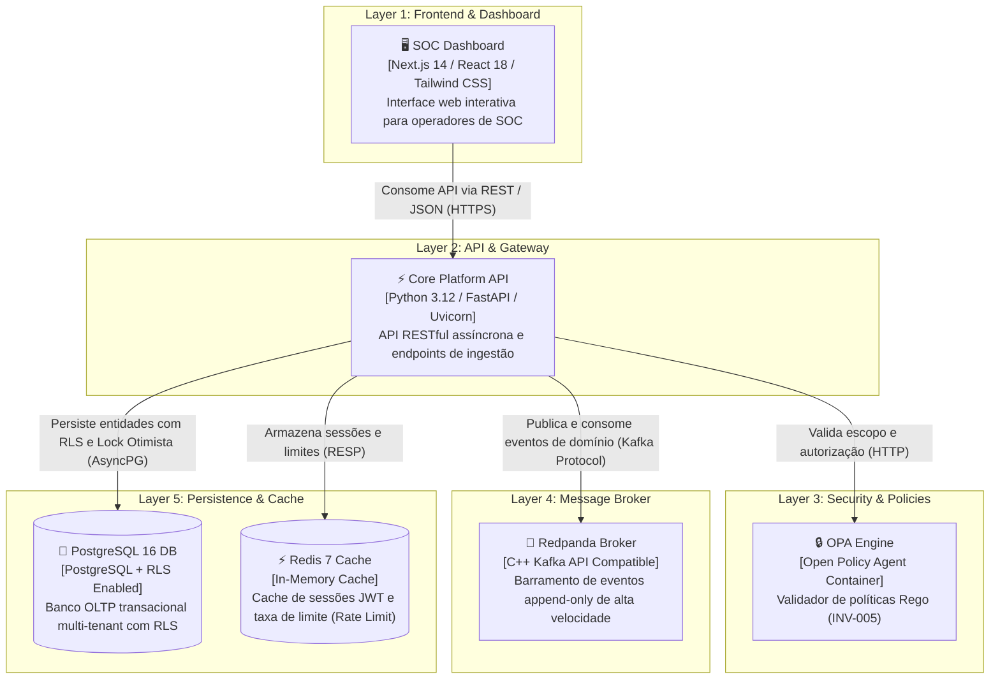
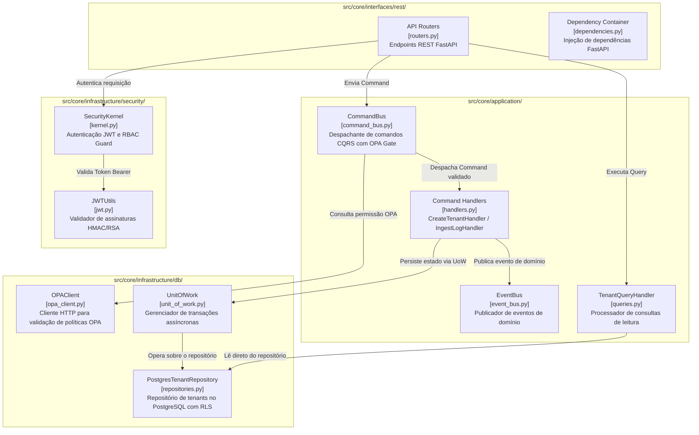

# Diagramas de Arquitetura C4 — GovSec Shield

Este documento especifica a arquitetura do **GovSec Shield** através do modelo C4 (Contexto, Contêineres e Componentes) utilizando sintaxe **Mermaid**.

---

## 1. Nível C1 — Diagrama de Contexto (System Context)

O Diagrama de Contexto ilustra o GovSec Shield no centro do ecossistema de segurança governamental, detalhando as interações com analistas de SOC, administradores municipais e sistemas externos integrados.

---

## 2. Nível C2 — Diagrama de Contêineres (Containers Diagram)

O Diagrama de Contêineres descreve a topologia interna das aplicações, barramentos de mensageria e bancos de dados que compõem o GovSec Shield.

---

## 3. Nível C3 — Diagrama de Componentes (Component Diagram: Core Platform)

O Diagrama de Componentes detalha os módulos internos do **Core Platform** (`src/core/`), demonstrando o fluxo interno CQRS, Security Kernel e acesso a dados.

