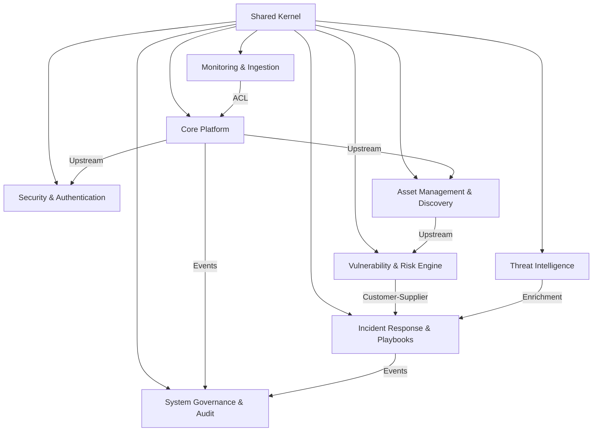

# Bounded Contexts do GovSec Shield

Este documento define os 9 **Bounded Contexts** da plataforma **GovSec Shield**, estabelecendo as responsabilidades, limites de domínio, interfaces públicas, eventos emitidos/consumidos e os relacionamentos de contexto (Context Mapping) segundo os princípios de Domain-Driven Design (DDD).

---

## 1. Core Platform (`src/core/`)
- **Responsabilidade:** Fundação e orquestração central do sistema operacional de segurança. Gerencia a infraestrutura multi-tenant, ciclo de vida de Tenants, barramentos de mensagem (`CommandBus`, `EventBus`) e integração com a Engine de Políticas OPA.
- **Limites:** Gestão de entidades organizacionais (Prefeituras, Secretarias) e barramento de comandos. Não trata de inteligência de ameaças ou varredura direta de ativos.
- **Eventos Produzidos:** `TenantCreatedEvent`, `TenantUpdatedEvent`, `TenantDeletedEvent`, `LogIngestedEvent`.
- **Eventos Consumidos:** Nenhum (Contexto central gerador).
- **Relacionamentos:** Upstream (Fornecedor de contexto) para todos os outros Bounded Contexts.

---

## 2. Security & Authentication (`src/security/`)
- **Responsabilidade:** Security Kernel da plataforma. Autenticação JWT, autorização via RBAC (Role-Based Access Control) com 5 níveis operacionais (`viewer`, `analyst`, `engineer`, `security_admin`, `system_admin`) e validação de escopo de rede (**ScopeSafety Protection - INV-005**).
- **Limites:** Emissão e verificação de identidade e credenciais. Não armazena dados operacionais de infraestrutura de ativos ou incidentes.
- **Eventos Produzidos:** `UserAuthenticatedEvent`, `AccessDeniedEvent`, `ScopeViolationDetectedEvent`.
- **Eventos Consumidos:** `TenantCreatedEvent`, `TenantDeletedEvent`.
- **Relacionamentos:** Conformist / Security Gate Upstream em relação aos serviços de API e interfaces REST.

---

## 3. Asset Management & Discovery (`src/asset/`)
- **Responsabilidade:** Inventário dinâmico de ativos governamentais (servidores, roteadores, firewalls, aplicações web) e motores de descoberta (`BaseScanner` e port scanning).
- **Limites:** Identificação e classificação de infraestrutura municipal. Não realiza análise de severidade de vulnerabilidades nem resposta ativa a incidentes.
- **Eventos Produzidos:** `AssetDiscoveredEvent`, `AssetUpdatedEvent`, `PortScanCompletedEvent`, `ScopeCheckFailedEvent`.
- **Eventos Consumidos:** `TenantCreatedEvent`, `ScopeViolationDetectedEvent`.
- **Relacionamentos:** Downstream do `Core Platform` e `Security Context`. Upstream para `Vulnerability & Risk Engine`.

---

## 4. Vulnerability & Risk Engine (`src/risk/`)
- **Responsabilidade:** Análise determinística e contínua de riscos cibernéticos. Cálculo de pontuação CVSS v3.1, enriquecimento com scores EPSS e atribuição de prioridade de remediação aos ativos.
- **Limites:** Avaliação de risco e priorização matemática de vulnerabilidades. Não executa bloqueios na rede nem altera rotas.
- **Eventos Produzidos:** `VulnerabilityIdentifiedEvent`, `AssetRiskCalculatedEvent`, `CriticalRiskThresholdExceededEvent`.
- **Eventos Consumidos:** `AssetDiscoveredEvent`, `PortScanCompletedEvent`, `LogIngestedEvent`.
- **Relacionamentos:** Downstream do `Asset Management`. Upstream para `Incident Response`.

---

## 5. Monitoring & Ingestion (`src/monitoring/`)
- **Responsabilidade:** Camada de ingestão de telemetrias de segurança de alta velocidade (Wazuh Agents, Zabbix, Syslog, Firewalls, Cloudflare). Anti-Corruption Layer (ACL) para normalização de payloads brutos em esquemas canônicos.
- **Limites:** Recepção, sanitização e enfileiramento de logs. Não toma decisões de resposta a incidentes.
- **Eventos Produzidos:** `TelemetryIngestedEvent`, `ConnectorFailedEvent`, `LogNormalizedEvent`.
- **Eventos Consumidos:** `TenantCreatedEvent`.
- **Relacionamentos:** Anti-Corruption Layer (ACL) entre coletores externos de terceiros e a mensagem interna do `Core Platform`.

---

## 6. Incident Response & Playbooks (`src/incident/` & `src/response/`)
- **Responsabilidade:** Gestão do ciclo de vida de incidentes de segurança (Abertura, Triagem, Mitigação, Encerramento) e execução automática de playbooks de resposta (ex: isolamento de host, bloqueio de IP no firewall).
- **Limites:** Ações de mitigação e workflows de contenção. Não realiza a ingestão primária dos logs brutos.
- **Eventos Produzidos:** `IncidentCreatedEvent`, `IncidentMitigatedEvent`, `PlaybookExecutedEvent`, `IncidentClosedEvent`.
- **Eventos Consumidos:** `CriticalRiskThresholdExceededEvent`, `ScopeViolationDetectedEvent`, `LogIngestedEvent`.
- **Relacionamentos:** Customer-Supplier em relação ao `Vulnerability & Risk Engine` e `Monitoring`.

---

## 7. Threat Intelligence (`src/intelligence/`)
- **Responsabilidade:** Coleta, agregação e distribuição de indicadores de comprometimento (IoCs: IPs maliciosos, hashes de malware, domínios de phishing) e cruzamento com fontes globais (MISP, AlienVault OTX).
- **Limites:** Fornecimento de contexto de ameaças externas. Não gerencia a infraestrutura interna do tenant.
- **Eventos Produzidos:** `IoCEnrichedEvent`, `ThreatFeedUpdatedEvent`, `MaliciousMatchDetectedEvent`.
- **Eventos Consumidos:** `TelemetryIngestedEvent`, `AssetDiscoveredEvent`.
- **Relacionamentos:** Supplier (Fornecedor de inteligência) para `Incident Response` e `Monitoring`.

---

## 8. System Governance & Audit (`src/system/`)
- **Responsabilidade:** Trilha de auditoria legal imutável (`AuditLogs`), transparência operacional, compliance com regulamentações públicas (LGPD, TCU, CGU) e interface da memória persistente do desenvolvimento (`MEMORIA.md` / `/api/memoria`).
- **Limites:** Registro e fiscalização de histórico de ações. Não bloqueia requisições em tempo real.
- **Eventos Produzidos:** `AuditRecordCreatedEvent`, `ComplianceReportGeneratedEvent`.
- **Eventos Consumidos:** Todos os eventos da plataforma (`*Event`).
- **Relacionamentos:** Sink Downstream universal (Consumidor de auditoria de todos os contextos).

---

## 9. Shared Kernel (`src/shared/`)
- **Responsabilidade:** Biblioteca central de código reutilizável contendo abstrações base de DDD (Entidades, Value Objects, Aggregates, DomainEvents), utilitários de observabilidade OpenTelemetry, decoradores assíncronos e definições de exceções base.
- **Limites:** Código utilitário agnóstico de regras de negócio específicas.
- **Eventos Produzidos:** Nativos das abstrações base (`DomainEvent`).
- **Eventos Consumidos:** Nativos.
- **Relacionamentos:** Shared Library utilizada diretamente por todos os 8 Bounded Contexts.

---

## 🔄 Mapa de Relacionamentos (Context Mapping Summary)

