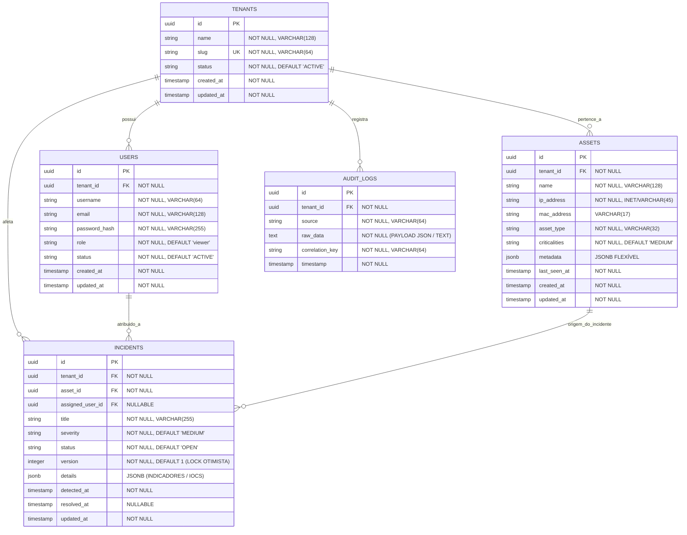

# Modelo Entidade-Relacionamento (ER Diagram) — GovSec Shield

Este documento especifica o **Modelo Entidade-Relacionamento (ER v5.4)** do banco de dados relacional **PostgreSQL 16+** do GovSec Shield, cobrindo as tabelas estruturais de `Tenants`, `Users`, `Assets`, `Incidents` e `AuditLogs`, com suporte nativo a isolamento **Row Level Security (RLS)** e estratégias de indexação otimizadas.

---

## 1. Diagrama ER Completo (Mermaid Syntax)



---

## 2. Detalhamento de Tabelas e Restrições de Chaves Estrangeiras

### 2.1 Tabela `tenants`
- **Descrição:** Tabela primária global de organizações e secretarias municipais.
- **Isolamento:** Global (Não possui RLS direto; serve como chave primária de isolamento para as demais tabelas).

### 2.2 Tabela `users`
- **Chave Estrangeira:** `tenant_id REFERENCES tenants(id) ON DELETE RESTRICT`.
- **Politica RLS:** `CREATE POLICY user_tenant_isolation ON users FOR ALL USING (tenant_id = current_setting('app.current_tenant')::uuid);`

### 2.3 Tabela `assets`
- **Chaves Estrangeiras:** `tenant_id REFERENCES tenants(id) ON DELETE RESTRICT`.
- **Politica RLS:** `CREATE POLICY asset_tenant_isolation ON assets FOR ALL USING (tenant_id = current_setting('app.current_tenant')::uuid);`

### 2.4 Tabela `incidents`
- **Chaves Estrangeiras:**
  - `tenant_id REFERENCES tenants(id) ON DELETE RESTRICT`
  - `asset_id REFERENCES assets(id) ON DELETE CASCADE`
  - `assigned_user_id REFERENCES users(id) ON DELETE SET NULL`
- **Concorrência Otimista:** O campo `version` é incrementado a cada update (`UPDATE incidents SET version = version + 1 WHERE id = :id AND version = :version`).

### 2.5 Tabela `audit_logs`
- **Chaves Estrangeiras:** `tenant_id REFERENCES tenants(id) ON DELETE RESTRICT`.
- **Idempotência:** Restrição `CONSTRAINT uq_audit_correlation UNIQUE (tenant_id, correlation_key)`.

---

## 3. Estratégias de Indexação Otimizadas (Recommended Indexes)

```sql
-- 1. Índices B-Tree para isolamento RLS e buscas por Tenant ID
CREATE INDEX idx_users_tenant_status ON users (tenant_id, status);
CREATE INDEX idx_assets_tenant_type ON assets (tenant_id, asset_type);
CREATE INDEX idx_incidents_tenant_status ON incidents (tenant_id, status, severity);
CREATE INDEX idx_audit_logs_tenant_timestamp ON audit_logs (tenant_id, timestamp DESC);

-- 2. Índices B-Tree para buscas textuais e Lookups de Identidade
CREATE UNIQUE INDEX idx_tenants_slug ON tenants (slug);
CREATE UNIQUE INDEX idx_users_email ON users (email);
CREATE INDEX idx_assets_ip ON assets (ip_address);

-- 3. Índices GIN em colunas JSONB para busca acelerada de atributos flexíveis
CREATE INDEX idx_assets_metadata_gin ON assets USING GIN (metadata);
CREATE INDEX idx_incidents_details_gin ON incidents USING GIN (details);

-- 4. Índice para tabela Inbox de Idempotência
CREATE INDEX idx_audit_correlation ON audit_logs (correlation_key);
```
