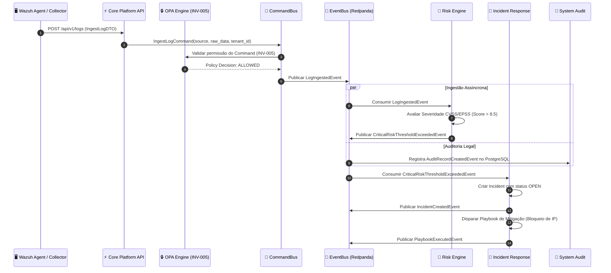
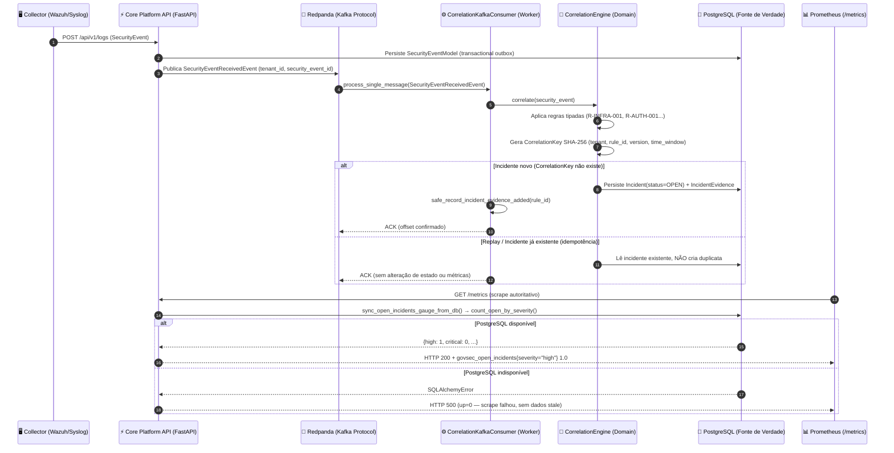
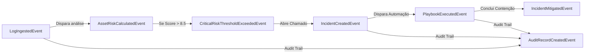

# Event Storming & Diagrama de Fluxos — GovSec Shield

Este documento mapeia o **Event Storming** do GovSec Shield, estabelecendo a relação entre os **Commands** (intenções de escrita), **Events** (fatos de domínio imutáveis), seus respectivos Bounded Contexts, fluxos operacionais de mitigação e correlação por `CorrelationID` e `TenantID`.

---

## 1. Tabela Matriz: Commands → Events por Bounded Context

| Bounded Context | Command (Intenção de Escrita) | Command Payload / Invariante | Evento Produzido (Fato Imutável) | Tópico Redpanda/Kafka |
|---|---|---|---|---|
| **Core Platform** | `CreateTenantCommand` | `name`, `slug` (único) | `TenantCreatedEvent` | `govsec.core.tenant-created` |
| **Core Platform** | `UpdateTenantCommand` | `tenant_id`, `name`, `status` | `TenantUpdatedEvent` | `govsec.core.tenant-updated` |
| **Core Platform** | `DeleteTenantCommand` | `tenant_id` (Soft Delete) | `TenantDeletedEvent` | `govsec.core.tenant-deleted` |
| **Core Platform** | `IngestLogCommand` | `source`, `raw_data`, `tenant_id` | `LogIngestedEvent` | `govsec.core.log-ingested` |
| **Security & Auth** | `AuthenticateUserCommand` | `username`, `password_hash` | `UserAuthenticatedEvent` | `govsec.security.auth-success` |
| **Security & Auth** | `CheckScopeCommand` | `target_ip` (Whitelist Check) | `ScopeCheckCompletedEvent` | `govsec.security.scope-checked` |
| **Asset Management** | `DiscoverAssetCommand` | `ip_address`, `hostname`, `type` | `AssetDiscoveredEvent` | `govsec.asset.discovered` |
| **Asset Management** | `ScanPortsCommand` | `target_cidr`, `ports_range` | `PortScanCompletedEvent` | `govsec.asset.scan-completed` |
| **Risk Engine** | `CalculateAssetRiskCommand` | `asset_id`, `cve_id`, `cvss_score` | `AssetRiskCalculatedEvent` | `govsec.risk.calculated` |
| **Incident Response** | `CreateIncidentCommand` | `asset_id`, `severity`, `details` | `IncidentCreatedEvent` | `govsec.incident.created` |
| **Incident Response** ✅ M3.2 | `ChangeIncidentStatusCommand` | `incident_id`, `to_status`, `actor_id`, `reason` | `IncidentStatusChangedEvent` | `govsec.incident.status-changed` |
| **Incident Response** ✅ M3.2 | `LinkEvidenceCommand` | `incident_id`, `security_event_id`, `rule_id` | `EvidenceLinkedEvent` | `govsec.incident.evidence-linked` |
| **Incident Response** | `ExecutePlaybookCommand` | `incident_id`, `playbook_name` | `PlaybookExecutedEvent` | `govsec.incident.playbook-executed` |
| **Correlation Engine** ✅ M3.2 | (Consumidor Kafka) `SecurityEventReceivedEvent` | `tenant_id`, `security_event_id` | `IncidentCorrelatedEvent` \| `EvidenceLinkedEvent` | `govsec.correlation.security-events` |
| **System Governance** | `RecordAuditLogCommand` | `actor_id`, `action`, `resource` | `AuditRecordCreatedEvent` | `govsec.system.audit-recorded` |

---

## 2. Fluxos Principais de Eventos

### Fluxo Operacional A: Ingestão de Alertas de Segurança → Análise de Risco → Mitigação Automática



---

## 3. Fluxo Operacional B: Correlação Determinística de Eventos → Incidente Aberto (M3.2 / M3.3) ✅



---

## 4. Envelope Canônico de Evento e Correlação de Dados (M0.7)

Todo evento emitido na infraestrutura Redpanda Kafka obedece ao seguinte envelope JSON unificado:

```json
{
  "event_id": "9b1deb4d-3b7d-4bad-9bdd-2b0d7b3dcb6d",
  "event_name": "LogIngestedEvent",
  "version": "1.0.0",
  "tenant_id": "b3e04135-2633-4f91-[#tenant]-85a5e3860000",
  "correlation_id": "corr-8f921a-4122-8902a",
  "timestamp": "2026-07-28T18:45:00.000Z",
  "partition_key": "asset-betim-saude-01",
  "payload": {
    "source": "wazuh-agent-01",
    "raw_data": "AUTHENTICATION_FAILED src_ip=185.220.101.5",
    "severity": "HIGH"
  }
}
```

---

## 4. Grafo de Relações de Eventos (Event Lineage Graph)


